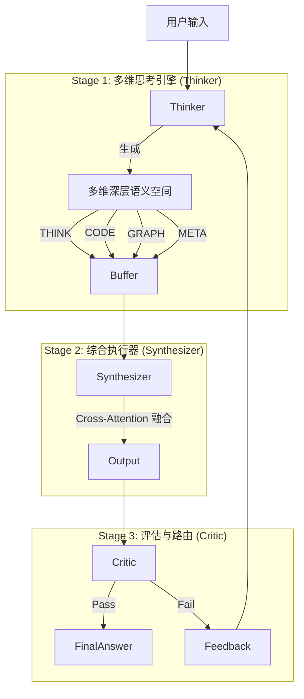

# v1 MDCDS — 三模型解耦 + 4 维语义空间审查

> **版本**：v1 (Multi-Dimensional Cognitive Dual-System)
> **评级**：D+（装饰性创新，无训练信号支撑）
> **核心失败模式**：用架构图把单模型 CoT 重新包装了一遍

---

## 一、方案概要

### 1.1 架构图

### 1.2 三个核心组件
- **Thinker (Model A)**：生成 THINK/CODE/GRAPH/META 四维语义
- **Synthesizer (Model B)**：用 Gated Cross-Attention 融合四维
- **Critic/Verifier (Model C)**：格式校验、代码验证、一致性检查、终止决策

### 1.3 训练流水线
- **Phase 1**：SFT 冷启动 + Parser 把自然语言 CoT 转为结构化标签
- **Phase 2**：联合 RL（R_final + R_format + R_code + R_consistency）
- **Phase 3**：迭代轨迹微调（"经过迭代后答案变好"的轨迹作为正样本）

### 1.4 推理协议
- **Round 1**：Thinker 生成完整多维语义，Synthesizer 生成答案，Critic 验证
- **Round 2+**：Thinker **仅 PATCH 受影响的语义块**，Synthesizer 修订，Critic 检查
- **终止**：连续 2 轮无改善 / 最大迭代 5 次 / Token 预算上限

---

## 二、致命缺陷（6 个）

### 缺陷 1【致命】4 维语义切分无训练信号支撑
**问题**：Transformer 的表示是高度纠缠的。没有训练数据告诉模型"dim 0-127 对应 THINK 概念，dim 128-255 对应 CODE 概念"。

**后果**：
- 切出来的 4 段隐藏状态**不会有清晰的语义分工**
- "可解释性优势"是假的，"分而治之"的训练优势也是假的
- 实质上是用 4 段独立参数跑 4 段相似计算

### 缺陷 2【致命】R_consistency 是伪命题
**问题**：THINK 和 CODE 本来就不需要"完全一致"——人类写代码时思考"我要算鸡的数量"但写 `if (heads == 2*chickens + 4*rabbits)`，思考是意图，代码是结构化转译。

**评判困境**：
- 用 LLM 裁判 → 引入第三个模型的偏置
- 用规则匹配 → 过度脆弱，无法处理等价改写
- 用执行结果反推 → 那不就是 R_code 吗？

**后果**：RL 训练会快速 hack 这个 reward——模型学会写"看起来 THINK 和 CODE 一致"的废话来刷分。

### 缺陷 3【致命】三模型解耦的接口开销 > 收益
**问题**：三模型协作意味着至少 2-3 次前向（Thinker → Critic → Synthesizer）。即便共享前 N 层，Synthesizer 还要再跑一次 decode。

**延迟估算**：
| 配置 | GSM8K P50 延迟 |
|------|---------------|
| 单模型 CoT | ~1.5s |
| v1 最低链路 | ~4.0s (3×) |
| v1 3 轮迭代 | ~8.0s (5×) |

**功能重叠**：Critic 实际就是"对自己或他人 CoT 打分"的 LLM，与 Thinker 同构。o1/R1 已证明：强 CoT 模型在 RL 后能内化 Critic 能力。

### 缺陷 4【严重】增量 Patch 不可行
**问题**：听起来优雅，本质上是把"如何推理"外包给了一个没有推理能力的模块。

**反例**：GSM8K 题"小明有 5 个苹果，吃了 2 个，又买了 3 个"。如果 Thinker 在第 2 步算成"5-2=2"（错），错误的根因是算术（CODE 维），但触发可能是没读懂"吃了"（THINK 维）。错误不会干净地落在某一维。

**实现障碍**：在连续向量空间里 patch 隐藏态没有实现路径——能 patch 哪个 token 对应的哪个隐藏状态？patch 多少维度？patch 后残差连接怎么处理？

### 缺陷 5【严重】迭代轨迹筛选稀疏
**问题**："经过迭代后答案变好"的轨迹作为正样本，"迭代后变差或死循环"的作为负样本。

**稀疏度估算**：GSM8K 测试集 1319 题，每题 N=8 条轨迹，"第二轮比第一轮好"的经验比例约 15-30%。**70% 以上样本对训练没贡献**。

**幸存者偏差**：只保留"变好"轨迹 = 只给模型看成功案例，会过拟合到模型已经会做的题上。

### 缺陷 6【中等】共享底层破坏解耦初衷
**问题**：共享 Embedding + 前 N 层意味着 A 和 B 必须共用 tokenizer/vocab/底层权重——这本身就是"它们其实是同一个模型的两个 head"。

**N 选几是无解题**：N 太小，省的时间不够；N 太大，A 和 B 越绑越紧，"解耦"名存实亡。

---

## 三、与现有工作的差异化对比

| v1 组件 | o1/R1 已做的事 |
|---------|---------------|
| Thinker 生成 CoT | o1 的 reasoning tokens |
| Critic 打分/反思 | R1 的 self-evolution、STaR |
| 迭代 refine | Self-Refine、Reflexion |
| 多教师蒸馏 | R1-Distill、o1-mini 蒸馏路线 |
| RL on CoT | R1-Zero、RLHF on reasoning |
| **4 维语义空间** | **无对应物（且无必要）** |
| **共享底层** | **无对应物（且不必要）** |

**核心结论**：4 维切分 + 共享底层这两个"创新点"都是空中楼阁，整个方案是 o1 + R1 + Reflexion 的缝合。

---

## 四、与现有 Tool-Use Agent 对比

- **ReAct**：已经有"推理 + 行动"的双模块，但共享一个 LLM
- **Reflexion**：反思 + 重试循环，结构上与 Thinker→Critic→Synthesizer 同构
- **Tool-Use Agent 真正优势**：调用外部工具（代码执行、搜索、计算器）。v1 的 CODE 维只是"内部表示"，**不调用 Python 解释器**——这意味着数学计算全靠 Thinker 内部推理，准确率天然低于 ReAct + Python REPL。

---

## 五、可借鉴的零碎洞察

1. **PRM 比隐藏态切分更可信**（PRM 有论文支撑，4 维语义切分没有）
2. **Engine-Native Verification 比 Critic LLM 更可靠**（Python REPL vs LLM-as-judge）
3. **搜索优于启发式迭代**（MCTS/Beam Search vs 连续 2 轮无改善终止）
4. **蒸馏路径优先于纯 RL**（OpenR1-Distill vs R1-Zero）

但 v1 没有意识到这些洞察，最终方案是"用更复杂的方式实现更简单的目标"。

---

## 六、对后续迭代的影响

v1 的失败直接催生了 v2 的修正方案：
- 放弃 4 维语义切分 → 改用 PRM
- 放弃三模型解耦 → 改用单模型 + Tool-Use
- 放弃增量 Patch → 改用 Best-of-N/MCTS
- 放弃 R_consistency → 改用 verifiable reward

但 v2 又在组件选型上犯了错（min(PRM)、标准 GRPO、R1-Zero），催生 v3 的 SOTA 精度对齐方案。

---

## 七、引用

1. Asai et al., "Self-RAG: Learning to Retrieve, Generate, and Critique through Self-Reflection" (ICLR 2024)
2. Madaan et al., "Self-Refine: Iterative Refinement with Self-Feedback" (NeurIPS 2023)
3. Shinn et al., "Reflexion: Language Agents with Verbal Reinforcement Learning" (NeurIPS 2023)
4. Yao et al., "ReAct: Synergizing Reasoning and Acting in Language Models" (ICLR 2023)
5. DeepSeek-R1 (Nature 2025, arXiv 2501.12948)

---

## 八、一句话评价

**v1 是"用架构图把单模型 CoT 重新包装"的典型案例——架构图比模型贡献大。** 4 维切分和共享底层是装饰性创新，R_consistency 是必然的 reward hacking 点，3 模型解耦的延迟开销没有任何收益支撑。