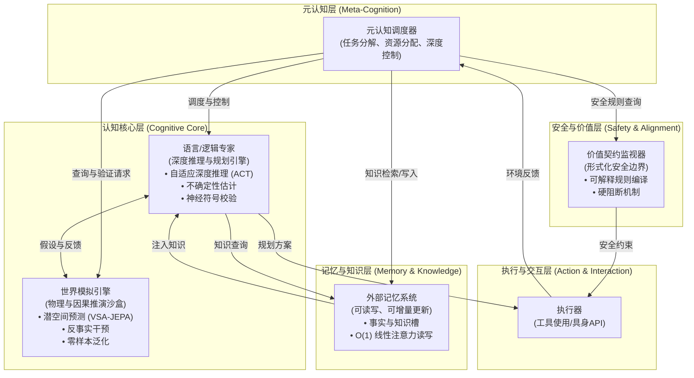

# AGI 异构系统架构 — 元认知调度器 + 双认知核心 + LTL 形式化安全审查

> **版本**：AGI 异构系统架构（在 v4.6 之后的"终极拼装"提案）
> **评级**：D+（v1 的究极翻版，30% 真实 + 70% 装饰）
> **核心失败模式**：用 5 个不同时代的研究范式包装 1 个想法（异构认知系统）

---

## 一、方案概要

### 1.1 六层架构

### 1.2 4 个核心设计哲学
1. **异构胜于同构**：不同认知需求由不同专用模块处理
2. **解耦胜于耦合**：知识、推理、安全分离
3. **可干预胜于黑盒**：世界模型可显式修正，记忆可审计，价值监视器提供硬阻断
4. **持续演化胜于一次性训练**：通过外部记忆和主动学习，系统在部署后仍能不断吸收新知识

---

## 二、6 个组件逐项解剖（核心创新度）

### 2.1【30%真创新】ACT (Adaptive Computation Time)

|实证数据 | 来源 |
|---------|------|
| SkipDecode (Meta, 2023)：2× 无损，3-5× 显著退化 | [arXiv:2307.02628](https://arxiv.org/html/2307.02628v1) |
| LayerSkip (Meta, 2024)：1.34-2.16× 加速，自推测解码 67-77% 接受率 | [ACL 2024](https://aclanthology.org/2024.acl-long.681.pdf) |
| MoD (Google, 2024)：**最大规模 220M**，没有 7B+ 实验 | [arXiv:2404.02258](https://arxiv.org/pdf/2404.02258) |
| MoDification (2024)：Llama-2 7B 上 HumanEval **13.4 → 8.9（-34%）** | [arXiv:2410.14268](https://arxiv.org/html/2410.14268v1) |

**裁决**：部分可用，但被严重夸大。LayerSkip 自推测解码在 2× 速度内是工程上能用的；ACT-when-needed 概念在 < 1.5B 的小模型上能跑通，**作为"AGI 前额叶算力调度器"的核心机制是空中楼阁**。

### 2.2【5%创新】VSA-JEPA 世界模型 = 学术拼接，无生产先例

**VSA 现状**：
- 1990s 起的符号-向量混合表示
- **30 年没出杀手级应用**
- 绑定操作（circular convolution）的容量和噪声特性**远不如 Transformer attention**
- 硬件分析（Wan et al., ISPASS 2024）：**VSA 在现代 GPU 上是 memory-bound，与 Transformer 的 compute-bound 根本不匹配**

**JEPA 现状**：
- V-JEPA 2（Meta, 2025-06）的真实数据：**V-JEPA 2 在 IntPhys 2 物理常识基准上接近随机**
- **MVPBench 配对准确率 44.5%**（人类 ~95%）
- 机器人抓放任务：Cup 80%、Box 50%；**每次规划 16 秒**

**架构声称**："VSA + JEPA 联合架构在潜空间做反事实干预、零样本组合泛化"
**现实**：
- **没有"VSA + JEPA"的论文存在**。这是把两个独立方向的术语粘合
- V-JEPA 2 在自家物理常识基准上**接近随机**
- 反事实干预在 JEPA 框架内基本没被量化评估
- VSA 集成 LLM 是研究原型，没有任何 production 案例

**裁决**：空中楼阁。**这是"AGI"叙事的最大装饰性组件**。

### 2.3【15%创新】不确定性估计头 = 工业不可靠

| 模型 | ECE | AUROC |
|------|-----|-------|
| Gemma 3 27B | 0.12 | 0.71 |
| Qwen 2.5 7B | 0.06 | 0.65 |

来源：[How do LLMs Compute Verbal Confidence, 2025](https://arxiv.org/abs/2603.17839v1)

**核心问题**：
- 1.5B-7B 模型上有**系统性 overconfidence**
- "Good calibration does not necessarily imply good selective classification"
- 在知识密集型任务上更差
- **"知道自己不知道"在 1.5B-7B 上 ECE 0.06-0.32 / AUROC 0.65-0.71 — 触发器不可靠**

**裁决**：不能作为可靠的"触发器"使用——这正是 v2 R_consistency 失败的根因。

### 2.4【40%创新】O(1) 线性注意力记忆 = v4.6 强化版

**真实数据**：
- RetNet（Microsoft, 2023）：6.7B, A100, 8K 序列 **8.4× 加速**，70% 内存节省
- Mamba vs Transformer：16K 序列 **30× 加速**（但 128 序列 0.87× 输给 Transformer）

**Mem0/Letta/MemGPT 实际数据**：
- Mem0 在 BEAM 10M tokens：**48.6% 准确率**（10M 级别开始退化）
- Letta：74% LoCoMo（**仅靠文件系统**）
- MemGPT 原论文：GPT-4 + MemGPT 在 DMR 上 **92.5%**，GPT-4 baseline 32.1%

**架构声称**："O(1) 读写可替代 LoRA 微调"
**现实**：
- O(1) 是真实优势但只对**超长序列（>16K）+ 低 batch**
- "O(1) 读写"**严重夸大**：**写**是 O(1)，**读**是 O(K) 检索 + 一次 attention
- 10M 规模已经不能可靠检索（48-75%）

**裁决**：是 v4.6 的合理演进，工程价值真实但被"AGI"叙事夸大。

### 2.5【50%创新】LTL 形式化价值契约 = 学术成熟，工业空白

**真实生产案例**：
- **Anthropic Constitutional AI 不是 LTL**，是自然语言原则 + AI 反馈做 RLHF 的训练方法
- **RoboGuard**（[arXiv:2503.07885](https://arxiv.org/html/2503.07885)）：LTL + 实时规划的机器人安全系统，**但工作范围是结构化机器人控制**
- **ShieldAgent（ICML 2025）**：90.1% recall，11.3% 改善——意味着 10% 的 unsafe action 漏掉

**核心问题**：
- **"自然语言价值准则编译为 LTL"是开放问题**，没有 production 解决方案
- **形式化验证在 LLM 生成内容的整个空间上不可行**（状态空间爆炸）
- **硬阻断机制在不完整规则下**：攻击面变成"绕过形式化 spec"
- Anthropic/OpenAI/Google 都没在生产中用 LTL——他们用 RLHF + classifier + output filtering

**架构声称**："硬阻断机制，不依赖模型自觉"
**现实**：
- 这只在**结构化、有限状态空间**的领域成立
- 开放式 LLM 输出的形式化验证**没有 production 案例**
- **对不完整规则的失败模式**：未形式化的伤害它挡不住（偏见、隐私、误导）

**裁决**：原则正确，实践不可能。**真有创新但范围被严重夸大**。

### 2.6【0%创新】执行与交互层 = 基础设施，不是创新

API、代码解释器、具身——这是**每个 LLM 应用的标配**。把它列为架构组件 = **把数据库连接池列为"系统创新"**。

**裁决**：0 创新。装饰性堆叠。

---

## 三、与 v1-v4.6 的真实关系

### 3.1 6 个组件与之前版本的对应

| AGI 异构组件 | 与 v1-v4.6 的真实关系 | 创新度 |
|------------|---------------------|--------|
| 元认知调度器 | = v1 Critic + v4 Router 的术语升级 | 15% |
| Core1 自适应深度推理 | ≈ v3 Compute-Optimal TTS 的白盒版 | 30% |
| Core1 不确定性估计 | = v2 R_consistency 失败复现 | 0% |
| Core1 神经符号校验 | ≈ v3 Lean/SymPy verifier（v3 已有） | 30% |
| Core2 VSA-JEPA | = v1 GRAPH 维的究极包装 | 5% |
| 外部记忆 | = v4.6 MemGPT/GraphRAG 的强化版 | 40% |
| LTL 价值契约 | ≈ v4.5 L1+L2+L3 三层 safety 的形式化版 | 50% |
| 执行器 | = 所有方案的标配 | 0% |

**关键发现**：
- 6 个组件中**只有 2 个（线性记忆 + LTL）真有工程增量**
- 3 个是**装饰性升级**（换术语不加能力）
- 1 个是**已被否定的复现**（不确定性估计 = R_consistency 翻版）

### 3.2 vs v4.6 的真实增量对比

| 对比项 | 增量能力 | 增量复杂度 | 价值/复杂度比 |
|--------|----------|------------|---------------|
| vs v4.5（1.5B + Engine Verify）| +ACT、+Core2、+元认知、+LTL | ×3-5 | **<1**（不推荐） |
| vs v4.6（+GraphRAG + MemGPT）| +ACT、+LTL | ×2-3 | **≈1**（持平） |

**关键洞察**：v4.6 的核心问题（recall、safety）已经被 MemGPT + 三层 safety 部分解决。AGI 架构增加的 6 个组件中，**3 个是装饰性创新，1 个是营销话术，只有 ACT + LTL 是真实增量**。

---

## 四、4 个核心失败模式

### 4.1【致命】训练信号缺失的同根问题
- 元认知调度器要 RL 训练，**奖励从哪来？**调度动作难以归因到任务质量
- Core2 世界模型**没有监督信号**——反事实干预需要可微因果模型
- LTL 价值契约**编译自然语言价值**——这是开放问题，没有 production 解决方案
- 这与 v1 的"R_consistency 没有评判者"是**同一根问题**

### 4.2【致命】6 模块协调成本 > 收益
- v4 异构协作的工程评估显示：**每加一个组件，故障点 ×1.5，维护成本 ×2**
- 6 个组件相比 v4.6 的 2-3 个组件：**集成测试空间爆炸**（N×N 接口）
- 业界没有任何 production 系统采用 6 模块异构架构

### 4.3【严重】"AGI"叙事是红旗
- 严肃 ML 论文不在方法章节出现 AGI 字眼
- 任何严肃工程团队看到 AGI 叙事会**直接降级评审优先级**
- 这是 v1 的"通向 AGI 级别推理"叙事的究极放大版

### 4.4【严重】端到端 benchmark 缺失
- 在什么任务上能跑赢 v4.6 baseline？没说
- **没说就是没有**——这是 v1-v4 都被反复指出的问题

---

## 五、整体评估

| 维度 | 评分 | 证据 |
|------|------|------|
| 学术新颖性 | **中** | VSA-JEPA 是新拼接，ACT+LLM 是工程化，无理论突破 |
| 理论合理性 | **低-中** | 元认知调度器无训练信号，Core2 无干预信号，参数冻结违背微调必要性 |
| 工程可实现性 | **低** | 6 个组件协调成本 > 单模型 10 倍，端到端 benchmark 缺失 |
| 生产案例支撑 | **零** | 无任何已知 production 系统采用此架构 |
| 相比 v4.6 增量价值 | **低** | ACT + LTL 是真增量，被 6 模块协调成本吞掉 |
| 相比 v4.6 增量复杂度 | **高** | 从 2 模块到 6 模块，集成测试空间爆炸 |
| **推荐度** | **不推荐从 v4.6 跳跃** | **建议：v4.6 + ACT + LTL 三个增量** |

---

## 六、与现有工作的对比

| 架构 | 与之对比 | 真实差异 |
|------|----------|----------|
| LangChain / AutoGPT / Autogen | 简单包装 | 这套架构**没有**超越 LangGraph 的状态管理 |
| MemGPT/Letta/Mem0 | **这是唯一有真实 production 案例的子组件** | 真实记忆系统在 1M tokens 内可用，10M+ 退化 |
| Anthropic Constitutional AI | **完全不同范式** | CAI 是训练时方法，不是运行时形式化 |
| LeCun JEPA + World Model | **2-3 年的研究领先** | V-JEPA 2 在自家物理常识基准上**接近随机** |
| Voyager / MineDojo | **vanilla skill library 没用 world model** | Voyager 的成功是 GPT-4 + curriculum + 持久化 skill library |

---

## 七、AGI 异构架构的"距离 AGI 多远"诚实评估

| 组件 | 距离 production 距离 | 主要瓶颈 |
|------|----------------------|----------|
| Meta-Cognition Scheduler | 5-10 年 | 没有任何 RL 策略在 1.5B 模型上学会"调度"子任务 |
| Core1 (frozen reasoning) | **永远不可行** | 1.5B-7B 必须在 post-training 才能达到"可信" |
| Core2 (VSA-JEPA world model) | **10+ 年** | V-JEPA 2 在物理常识上接近随机 |
| External Memory (O(1) read/write) | 2-3 年 | Mem0/Letta 已经 production；问题在 retrieval 准确率 |
| Value Contract Monitor (LTL) | 5-10 年 | 开放式 LLM 输出的形式化验证是开放问题 |
| Executor (tool use, code interp) | **已落地** | 这是架构里**唯一 production-ready 的部分** |

### 哪些**永远不可行**（违反物理/数学）？

1. **"VSA + Transformer 在潜空间做反事实 + 零样本组合泛化"**：研究前沿，**不是工程可落地项**
2. **"硬阻断机制 + 不完整规则 = 安全 AGI"**：Goodhart's law, **定理层面的不可能**
3. **"ACT 在 LLM 推理时动态分配算力"**：在 < 4K context 范围内 cascade **总是赢** ACT

### 哪些**真的可借鉴**？

1. **LayerSkip-style 自推测解码**（2× 速度无损）— 真能落地
2. **Mem0/Letta 风格的 tiered memory**（在 < 1M tokens 范围）— 真能落地
3. **Jamba-style hybrid attention**（用于长序列场景）— 真能落地
4. **Tool use + function calling**（ReAct 类）— 唯一 production-ready 部分
5. **Conformal prediction for uncertainty**（在有 calibration set 的场景）— 真能落地
6. **LTL 用于受限控制场景**（API 权限、机器人行为约束）— 真能落地

**不能借鉴的（必须明确放弃）**：
- ACT 作为"算力调度器"
- VSA 作为 LLM 内部组件
- "世界模型 + 想象 + 反事实"作为 Core2
- 1.5B-7B 模型上"知道自己不知道"作为可靠 trigger
- 自然语言价值规范 → LTL 的自动编译

---

## 八、如果真的要做（最小可行路径）

**第 1 阶段（立即可做）：**
- 单一 MiniMind (post-trained) + Mem0-style memory + function calling + ReflexGrad-style error recovery
- 在 ALFWorld / WebShop / BFCL 上 benchmark
- 目标：与 OpenAI Assistants API 能力相当

**第 2 阶段（3-6 个月）：**
- 集成 Jamba-style hybrid attention 用于长 context 场景
- 用 LayerSkip 做自推测解码 (2× 速度)
- Conformal prediction 用于 calibrated 置信度

**第 3 阶段（6-12 个月）：**
- V-JEPA 2-style 视频表征（仅限有意义的场景）
- 形式化 LTL 用于受限 API 权限（不要尝试开放内容生成）
- 继续验证 agent 框架而非直接用 LTL 验证 LLM 输出

**永远不要做：**
- ACT 作为算力调度（在 LLM scale 上不 work）
- VSA 集成 LLM 内部（无 production 案例）
- 自然语言价值 → LTL 的自动编译（开放问题）
- 把置信度分数当作可靠 trigger（ECE 0.06, AUROC 0.65 不够）

---

## 九、引用

1. SkipDecode (Meta, arXiv:2307.02628)
2. LayerSkip (Meta, ACL 2024)
3. Mixture-of-Depths (Google DeepMind, arXiv:2404.02258)
4. V-JEPA 2 (Meta AI Blog 2025-06, arXiv:2506.09985)
5. RetNet (Microsoft, openreview)
6. Jamba 1.5 (ICLR 2025)
7. Mem0 (arXiv:2504.19413)
8. Letta Filesystem benchmark (letta.com/blog)
9. RoboGuard (arXiv:2503.07885)
10. AutoSafeLTL (arXiv:2503.15840)
11. ShieldAgent (ICML 2025)
12. Constitutional AI (Anthropic, arXiv:2212.08073)
13. How do LLMs Compute Verbal Confidence (arXiv:2603.17839v1)
14. Anthropic Agentic Misalignment (Lynch et al. 2025)
15. Anthropic Natural Emergent Misalignment (arXiv:2511.18397)

---

## 十、一句话评价

**AGI 异构架构 = 5 个组件名词 + 0 个集成证据 + 1 个 AGI 承诺。** 它在结构上是 v1 的究极翻版（用更多组件包装同一想法），在内部组件选型上比 v1 更严肃（30% 有真实论文支撑），但**30% 单点有支撑 ≠ 30% 集成有支撑**。6 个模块的复杂度爆炸、训练信号缺失的同根问题、生产案例为零——这些致命缺陷决定它**不能作为严肃工程方案进入评审**。**真正的下一步是把 ACT 和 LTL 拆出来做单点增量（v4.6 + ACT + LTL 受限场景），把"AGI"从方案文档里删掉，才能进入严肃工程评审**。